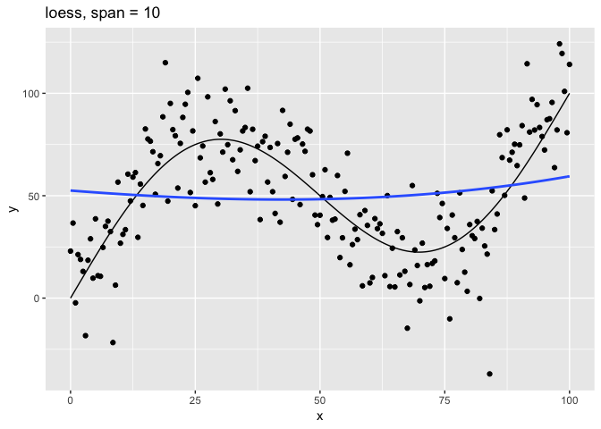
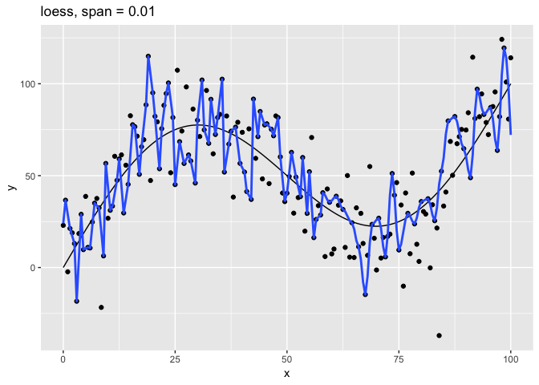

<!-- Generated automatically from model-eval.yml. Do not edit by hand -->

# Model evaluation <small class='model'>[model]</small>
<small>(Builds on: [Models with multiple variables](model-multivariate.md))</small>


``` r
library(tidyverse)
library(modelr)
```

A crucial part of the modeling process is determining the quality of
your model. In this reading, we’ll explore how to compare different
models to each other and pick the one that best approximates your data.

## The problem

In order to illustrate the process of model evaluation, we’re going to
use simulated data. To simulate data, you pick a function and use that
function to generate a series of data points. We can then compare any
models we make to the true function used to generate the data.

Note that you almost always won’t actually know the functional
representation underlying your data. If you did, you probably wouldn’t
need a model in the first place.

For our simulated data, let’s assume there’s some phenomenon that has a
functional representation of the form

    y = f(x)

In other words, the phenomenon is purely a function of the variable `x`,
and so, if you know `x`, you can figure out the behavior of the
phenomenon. Here’s the function `f()` that we’ll use.

``` r
# True function
f <- function(x) x + 50 * sin((pi / 50) * x)
```

`f()` is the true function, but let’s also assume that any measurements
of `y` will have errors. To simulate errors, we need a function that
adds random noise to `f()`. We’ll call this function `g()`.

``` r
# Function with measurement error
g <- function(x) f(x) + rnorm(n = length(x), mean = 0, sd = 20)
```

We can use `g()` to generate a random sample of data.

``` r
# Function that generates a random sample of data points, using g()
sim_data <- function(from, to, by) {
  tibble(
    x = seq(from = from, to = to, by = by),
    y = g(x)
  )
}

# Generate random sample of points to approximate
set.seed(439)
data_1 <- sim_data(0, 100, 0.5)
```

Here’s a plot of both the simulated data (`data_1`), and the true
function. Our job is now to use the simulated data to create a function
that closely approximates the true function.

``` r
tibble(x = seq(0, 100, 0.5), y = f(x)) %>% 
  ggplot(aes(x, y)) +
  geom_line() +
  geom_point(data = data_1) +
  labs(title = "True function and simulated data")
```

<!-- -->

## The `loess()` model

Given the shape of our data, the `stats::loess()` function is a good
place to start. `loess()` works by creating a local model at each data
point. Each of these local models only uses data within a given distance
from that point. The `span` parameter controls how many points are
included in each of these local models. The smaller the span, the fewer
the number of points included in each local model.

To better understand the effect of the `span` parameter, let’s plot
`loess()` models with different values of `span`.

The function `plot_loess()` fits a model using `loess()`, then plots the
model predictions and the underlying data.

``` r
# Plot loess model for given span
plot_loess <- function(span) {
  data_1 %>% 
    mutate(f = f(x)) %>% 
    add_predictions(loess(y ~ x, data = data_1, span = span)) %>% 
    ggplot(aes(x)) +
    geom_line(aes(y = f)) +
    geom_point(aes(y = y)) +
    geom_line(aes(y = pred), color = "#3366FF", size = 1) +
    labs(
      title = str_glue("loess, span = {span}"),
      y = "y"
    )
}
```

Now, we can use purrr to apply `plot_loess()` to a vector of different
span values.

``` r
c(10, 1, 0.75, 0.1, 0.01) %>% 
  map(plot_loess) %>% 
  walk(print)
```

<!-- --><!-- --><!-- --><!-- --><!-- -->

The `span` parameter clearly makes a big difference in the model:

  - `span = 10` smooths too much and washes out the variability in the
    model.
  - `span = 1` is much better, but still has a bit too much smoothing.
  - `span = 0.75` is the default and does a reasonably good job.
  - `span = 0.1` has too little smoothing. The added complexity has
    started tracking the random variation in our data.
  - `span = 0.01` went way too far and started to fit individual random
    points.

It’s clear that the model with `span = 0.75` comes closest to following
the form of the true model. The models with `span` equal to `0.1` and
`0.01` have **overfit** the data, and so won’t generalize well to new
data.

## Test and training errors

Let’s return to the question of how to measure the quality of a model.
Above, we could easily visualize our different models because they each
had only one predictor variable, `x`. It will be much harder to
visualize models with many predictor variables, and so we need a more
general way of determining model quality and comparing models to each
other.

One way to measure model quality involves comparing the model’s
predicted values to the actual values in data. Ideally, we want to know
the difference between predicted and actual values on *new* data. This
difference is called the **test error**.

Unfortunately, you usually won’t have new data. All you’ll have is the
data used to create the model. The difference between the predicted and
actual values on the data used to train the model is called the
**training error**.

Since the expected value for the error term of `g()` is `0` for each
`x`, the best possible model for new data would be `f()` itself. The
error on `f()` itself is called the **Bayes error**.

Usually, you won’t know the true function `f()`, and you won’t have
access to new test data. In our case, we simulated data, so we know
`f()` and can generate new data. The following code creates 50 different
samples, each the same size. We’ll use these 50 different samples to get
an accurate estimate of our test error.

``` r
set.seed(886)

data_50 <- 
  1:50 %>% 
  map_dfr(~ sim_data(0, 100, 0.5))
```

Now, we need a way to measure the difference between a vector of
predictions and vector of actual values. Two common metrics include:

  - Root-mean-square error (RMSE): `sqrt(mean((y - pred)^2, na.rm =
    TRUE))`
  - Mean absolute error (MAE): `mean(abs(y - pred), na.rm = TRUE)`

Both measures are supported by modelr. We’ll use RMSE below.

Now, we’ll train a series of models on our original dataset, `data_1`,
using a range of `span`’s. Then, for each model, we’ll calculate the
training error on `data_1` and the test error on the new data in
`data_50`.

First, we need to create a vector of different `span` values.

``` r
spans <- 2^seq(1, -2, -0.2)
```

Next, we can use purrr to iterate over the span values, fit a model for
each one, and calculate the RMSE.

``` r
errors <- 
  tibble(span = spans) %>% 
  mutate(
    train_error =
      map_dbl(span, ~ rmse(loess(y ~ x, data = data_1, span = .), data_1)),
    test_error =
      map_dbl(span, ~ rmse(loess(y ~ x, data = data_1, span = .), data_50))
  )
```

The result is a tibble with a training error and test error for each
`span`.

``` r
errors
```

    ## # A tibble: 16 x 3
    ##     span train_error test_error
    ##    <dbl>       <dbl>      <dbl>
    ##  1 2            27.7       27.4
    ##  2 1.74         26.9       26.7
    ##  3 1.52         25.9       25.7
    ##  4 1.32         24.6       24.6
    ##  5 1.15         22.8       23.0
    ##  6 1            21.3       21.8
    ##  7 0.871        19.3       20.4
    ##  8 0.758        18.7       20.2
    ##  9 0.660        18.5       20.2
    ## 10 0.574        18.4       20.3
    ## 11 0.5          18.4       20.3
    ## 12 0.435        18.3       20.4
    ## 13 0.379        18.1       20.4
    ## 14 0.330        17.8       20.4
    ## 15 0.287        17.4       20.6
    ## 16 0.25         17.2       20.8

It would be useful to compare these errors to the Bayes error, the error
on the true function, which you can think of as the “best-case-scenario”
error. The RMSE Bayes error is 20, the standard deviation of the random
errors added by `g()`. We can check this with an approximation using
`data_50`.

``` r
bayes_error <- 20
 
data_50 %>% 
  summarize(bayes_error = sqrt(mean((y - f(x))^2, na.rm = TRUE))) %>% 
  pull(bayes_error)
```

    ## [1] 19.9741

Now, let’s plot the training, test, and Bayes errors by `span`.

``` r
bayes <- tibble(
  span = range(errors$span),
  type = "bayes_error",
  error = bayes_error
)

errors %>% 
  gather(key = type, value = error, -span) %>% 
  ggplot(aes(1 / span, error, color = type)) + 
  geom_line(data = bayes) +
  geom_line() +
  geom_point() +
  labs(
    title = "Errors as a function of increasing model complexity",
    color = NULL
  )
```

<!-- -->

Mapping 1 / `span` to the x-axis makes the plot easier to interpret
because smaller values of `span` create more complex models. The
leftmost points indicate the simplest models, and the rightmost indicate
the most complex.

The lowest test error is around 20.18, and came from the model with
`span` ≈ 0.758. Note that the default value of `span` in `loess()` is
0.75, so the default here would have done pretty well.

You can see that as the model increases in complexity, the training
error (blue line) continually declines, but the test error (green line)
actually starts to increase. The test error increases for values of
`span` that make the model too complex overfit the training data.

We used `data_50`, our new data, to calculate the actual test error. As
we’ve said, though, you usually won’t have access to new data and so
won’t be able to calculate the test error. You’ll need a way to
estimate the test error using the training data. As our plot indicates,
however, the training error is a poor estimate of the actual test error.
In the next section, we’ll discuss a better way, called
*cross-validation*, to estimate the test error from the training data.

## Cross-validation

There are two key ideas of cross-validation. First, in the absence of
new data, we can hold out of a random portion of our original data (the
test set), train the model on the rest of the data (the training set),
and then test the model on test set. Second, we can generate multiple
train-test pairs to create a more robust estimate of the true test
error.

modelr provides two functions for generating these train-test pairs:
`crossv_mc()` and `crossv_kfold()`. We’ll introduce these functions in
the next section.

### Generating train-test pairs with `crossv_mc()` and `crossv_kfold()`

`crossv_mc()` and `crossv_kfold()` both take your original data as input
and produce a tibble that looks like this:

``` r
data_1 %>% 
  crossv_kfold()
```

    ## # A tibble: 5 x 3
    ##   train          test           .id  
    ##   <list>         <list>         <chr>
    ## 1 <S3: resample> <S3: resample> 1    
    ## 2 <S3: resample> <S3: resample> 2    
    ## 3 <S3: resample> <S3: resample> 3    
    ## 4 <S3: resample> <S3: resample> 4    
    ## 5 <S3: resample> <S3: resample> 5

Each row represents one train-test pair. Eventually, we’re going to
build a model on each train portion, and then test that model on each
test portion.

`crossv_mc()` and `crossv_kfold()` differ in how they generate the
train-test pairs.

`crossv_mc()` takes two parameters: `n` and `test`. `n` specifies how
many train-test pairs to generate. `test` specifies the portion of the
data to hold out each time. Importantly, `crossv_mc()` pulls randomly
from the entire dataset to create each train-test split. This means that
the test sets are not mutually exclusive. A single point can be present
in multiple test sets.

`crossv_kfold()` takes one parameter: `k`, and splits the data into `k`
exclusive partitions, or *folds*. It then uses each of these `k` folds
as a test set, with the remaining `k` - 1 folds as the training set. The
main difference between `crossv_mc()` and `crossv_kfold()` is that the
`crossv_kfold()` test sets are mutually exclusive.

Now, let’s take a closer look at how these functions works. The
following code uses `crossv_kfold()` to create 10 train-test pairs.

``` r
set.seed(122)

df <- 
  data_1 %>% 
  crossv_kfold(k = 10)

df
```

    ## # A tibble: 10 x 3
    ##    train          test           .id  
    ##    <list>         <list>         <chr>
    ##  1 <S3: resample> <S3: resample> 01   
    ##  2 <S3: resample> <S3: resample> 02   
    ##  3 <S3: resample> <S3: resample> 03   
    ##  4 <S3: resample> <S3: resample> 04   
    ##  5 <S3: resample> <S3: resample> 05   
    ##  6 <S3: resample> <S3: resample> 06   
    ##  7 <S3: resample> <S3: resample> 07   
    ##  8 <S3: resample> <S3: resample> 08   
    ##  9 <S3: resample> <S3: resample> 09   
    ## 10 <S3: resample> <S3: resample> 10

The result is a tibble with two list-columns: `train` and `test`. Each
element of `train` and `test` is a resample object, which you might not
have seen before. Let’s look at the first row, the first train-test
pair.

``` r
train_01 <- df$train[[1]]
train_01
```

    ## <resample [180 x 2]> 1, 3, 4, 5, 6, 7, 9, 10, 11, 12, ...

``` r
test_01 <- df$test[[1]]
test_01
```

    ## <resample [21 x 2]> 2, 8, 21, 43, 53, 63, 78, 81, 85, 101, ...

Each resample object is actually a two-element list.

``` r
glimpse(train_01)
```

    ## List of 2
    ##  $ data:Classes 'tbl_df', 'tbl' and 'data.frame':    201 obs. of  2 variables:
    ##   ..$ x: num [1:201] 0 0.5 1 1.5 2 2.5 3 3.5 4 4.5 ...
    ##   ..$ y: num [1:201] 22.95 36.64 -2.32 21.26 18.88 ...
    ##  $ idx : int [1:180] 1 3 4 5 6 7 9 10 11 12 ...
    ##  - attr(*, "class")= chr "resample"

The first element, `data` is the original dataset. The second element,
`idx`, is a set of indices that indicate the subset of the original data
to use.

We can use a set operation to verify that the train and test sets are
mutually exclusive. In other words, there is no point in a given train
set that is also in its corresponding test set, and vice versa.

``` r
is_empty(intersect(train_01$idx, test_01$idx))
```

    ## [1] TRUE

The union of each train and test set is just the complete original
dataset. We can verify this by checking that the set of all train and
test indices contains every possible index in the original dataset.

``` r
setequal(union(train_01$idx, test_01$idx),  1:201)
```

    ## [1] TRUE

resample objects are not tibbles. Some model functions, like `lm()`, can
take resample objects as input, but `loess()` cannot. In order to use
`loess()`, we’ll need to turn the resample objects into tibbles.

``` r
as_tibble(test_01)
```

    ## # A tibble: 21 x 2
    ##        x     y
    ##    <dbl> <dbl>
    ##  1   0.5  36.6
    ##  2   3.5  18.5
    ##  3  10    26.8
    ##  4  21    79.3
    ##  5  26    68.5
    ##  6  31   102. 
    ##  7  38.5  76.4
    ##  8  40    73.6
    ##  9  42    37.1
    ## 10  50    40.5
    ## # … with 11 more rows

Resample objects waste a lot of space, since each one contains the full
dataset. A new package [rsample](https://topepo.github.io/rsample/) is
being developed to support tidy modeling in a more space-efficient way.

### Process

`crossv_kfold()` and `crossv_mc()` just generate train-test pairs. In
order to carry out cross-validation, you still need to fit your model on
each train set and then evaluate it on each corresponding test set. In
this section, we’ll walk you through the process.

**1** Create a function to calculate your test error

First, you’ll need a function that calculates the test error using some
metric. We’ll use RMSE. The following function returns the RMSE for a
given span, train set, and test set.

``` r
rmse_error <- function(span, train, test) {
  rmse(loess(y ~ x, data = as_tibble(train), span = span), as_tibble(test))
}
```

**2** Create a function to calculate CV error

Next, you need a function that iterates over all your train-test pairs,
calculates the test error for each pair, and then calculates the mean of
the errors and the standard error of the mean.

``` r
span_error <- function(span, data_cv) {
  errors <- 
    data_cv %>% 
    select(-.id) %>% 
    add_column(span = span) %>% 
    pmap_dbl(rmse_error)
  
  tibble(
    span = span,
    error_mean = mean(errors, na.rm = TRUE),
    error_se = sd(errors, na.rm = TRUE) / sqrt(length(errors))
  )
}
```

**3** Create your train-test pairs

Use either `crossv_mc()` or `crossv_kfold()` to generate your train-test
pairs. We’ll use `crossv_mc()` to generate 10 train-test pairs with test
sets consisting of approximately 20% of the data.

``` r
set.seed(430)

data_mc <- crossv_mc(data_1, n = 10, test = 0.2)
```

**4** Calculate the CV error for different values of your tuning
parameter

We want to compare different values of `span`, so we also need to
iterate over a vector of different `span` values. We’ll calculate the CV
error for all `span`s using these train-test pairs.

``` r
errors_mc <- 
  spans %>% 
  map_dfr(span_error, data_cv = data_mc)

errors_mc %>% 
  knitr::kable()
```

|      span | error\_mean | error\_se |
| --------: | ----------: | --------: |
| 2.0000000 |    28.77162 | 0.4598847 |
| 1.7411011 |    27.90898 | 0.4590082 |
| 1.5157166 |    26.80809 | 0.4633976 |
| 1.3195079 |    25.42115 | 0.4763469 |
| 1.1486984 |    23.47827 | 0.5162414 |
| 1.0000000 |    21.89512 | 0.5574787 |
| 0.8705506 |    19.70633 | 0.6247474 |
| 0.7578583 |    19.00509 | 0.6083815 |
| 0.6597540 |    18.79978 | 0.5899732 |
| 0.5743492 |    18.80655 | 0.5736369 |
| 0.5000000 |    18.82917 | 0.5663217 |
| 0.4352753 |    18.87305 | 0.5575942 |
| 0.3789291 |    18.85135 | 0.5313073 |
| 0.3298770 |    18.78642 | 0.4918808 |
| 0.2871746 |    18.72327 | 0.5003602 |
| 0.2500000 |    18.70617 | 0.5152749 |

**5** Choose the best model

Now, we need to compare the different models and choose the best value
of `span`.

Because we simulated our data, we can compare the CV estimates of the
test error with the actual test error.

``` r
errors_mc %>% 
  left_join(errors, by = "span") %>% 
  ggplot(aes(1 / span)) +
  geom_line(aes(y = test_error, color = "test_error")) +
  geom_point(aes(y = test_error, color = "test_error")) +
  geom_line(aes(y = error_mean, color = "mc_error")) +
  geom_pointrange(
    aes(
      y = error_mean, 
      ymin = error_mean - error_se,
      ymax = error_mean + error_se,
      color = "mc_error"
    )
  ) +
  labs(
    title = "Cross-validation and test errors",
    y = "error",
    color = NULL
  )
```

<!-- -->

From this plot, we can see that CV error estimates from `crossv_mc()`
underestimate the true test error in the range with `1/span` \> 1. The
line ranges reflect one standard error on either side of the mean error.

Usually, you won’t have access to the true test error, so we need a way
to choose the best value of `span` using just the CV errors. Here’s the
rule-of-thumb for choosing a tuning parameter when you only know the CV
errors.

  - Start with the parameter that has the lowest mean CV error. In this
    case, that would be `span` = 0.25 (on the plot, `1/span` = 4) with
    an mean CV error of approximately 18.7.
  - Then choose the simplest model whose mean CV error is within one
    standard error of the lowest value. The standard error for `span` =
    0.25 is approximately 0.5, so we are seeking the simplest model with
    a mean CV error less than 19.2. This occurs for `span` ≈ 0.758 (on
    the plot, `1/span` ≈ 1.32).

We saw above that if we knew the test error, we would choose `span` ≈
0.758 as the optimal parameter. The one-standard-error rule of thumb
would lead us to choose the same optimal parameter without having to
know the test error. The test error for this `span` is very close to the
Bayes error of 20.

``` r
errors %>% 
  top_n(-1, test_error) %>% 
  select(span, test_error) %>% 
  knitr::kable()
```

|      span | test\_error |
| --------: | ----------: |
| 0.7578583 |     20.1787 |

