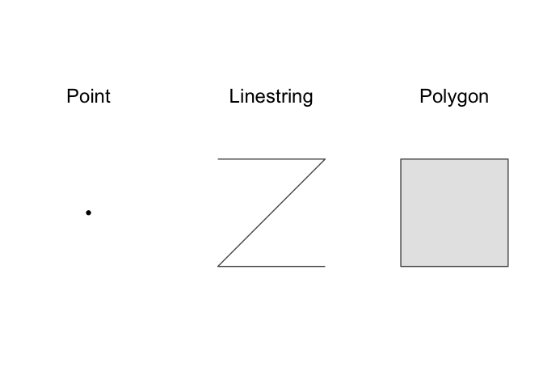
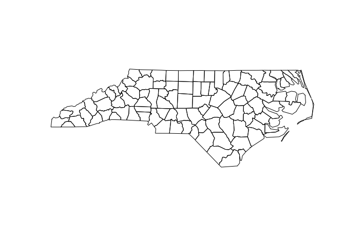
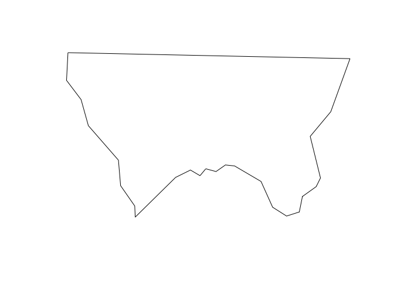

<!-- Generated automatically from spatial-basics.yml. Do not edit by hand -->

# Spatial basics <small class='wrangle'>[wrangle]</small>
<small>(Builds on: [Manipulation basics](manip-basics.md))</small>  
<small>(Leads to: [Spatial visualization](spatial-vis.md))</small>


## Spatial packages

In R, there are two main lineages of tools for dealing with spatial
data: sp and sf.

  - sp has been around for a while (the first release was in 2005), and
    it has a rich ecosystem of tools built on top of it. However, it
    uses a rather complex data structure, which can make it challenging
    to use.

  - sf is newer (first released in October 2016) so it doesn’t have such
    a rich ecosystem. However, it’s much easier to use and fits in very
    naturally with the tidyverse.

There’s a lot you can do with the sf package, and it contains many more
functions that we can cover in this reading. The sf package [reference
page](https://r-spatial.github.io/sf/reference/index.html) lists all of
the functions in the package. There are also some helpful articles on
the package website, including [Simple Features for
R](https://r-spatial.github.io/sf/articles/sf1.html) and [Manipulating
Simple Feature
Geometries](https://r-spatial.github.io/sf/articles/sf3.html).

## Loading data

To read spatial data in R, use `read_sf()`. The following code reads an
example dataset built into the sf package.

``` r
library(tidyverse)
library(sf)

# The counties of North Carolina
nc <- read_sf(system.file("shape/nc.shp", package = "sf"))
```

Here, `read_sf()` reads from a **shapefile**. Shapefiles are the most
common way to store spatial data. Despite the name, a shapefile is
actually a collection of files, not a single file. Each file in a
shapefile has the same name, but a different extension. Typically,
you’ll see four files:

  - `.shp` contains the geometry

  - `.shx` contains an index into that geometry.

  - `.dbf` contains metadata about each geometry (the other columns in
    the data frame).

  - `.prf` contains the coordinate system and projection information.
    You’ll learn more about that shortly.

`read_sf()` can read in the majority of spatial file formats, and can
likely handle your data even if it isn’t in a shapefile.

## Data structure

`read_sf()` reads in spatial data and creates a tibble, so `nc` is a
tibble.

``` r
class(nc)
#> [1] "sf"         "tbl_df"     "tbl"        "data.frame"
```

`nc` functions like an ordinary tibble with one exception: the
**geometry** column.

``` r
nc %>% 
  select(geometry)
#> Simple feature collection with 100 features and 0 fields
#> geometry type:  MULTIPOLYGON
#> dimension:      XY
#> bbox:           xmin: -84.32385 ymin: 33.88199 xmax: -75.45698 ymax: 36.58965
#> epsg (SRID):    4267
#> proj4string:    +proj=longlat +datum=NAD27 +no_defs
#> First 10 features:
#>                          geometry
#> 1  MULTIPOLYGON (((-81.47276 3...
#> 2  MULTIPOLYGON (((-81.23989 3...
#> 3  MULTIPOLYGON (((-80.45634 3...
#> 4  MULTIPOLYGON (((-76.00897 3...
#> 5  MULTIPOLYGON (((-77.21767 3...
#> 6  MULTIPOLYGON (((-76.74506 3...
#> 7  MULTIPOLYGON (((-76.00897 3...
#> 8  MULTIPOLYGON (((-76.56251 3...
#> 9  MULTIPOLYGON (((-78.30876 3...
#> 10 MULTIPOLYGON (((-80.02567 3...
```

The `geometry` column contains **simple features**. Simple features are
a standard way of representing geometry types. The most basic geometry
types are point, linestring, and polygon.

<!-- -->

There are also *multi* variants of these basic types: multipoint,
multilinestring, and multipolygon. These multi types can contain
multiple points, linestrings, or polygons. The final type, geometry
collection, can contain multiple different types (e.g., points,
linestrings, and multipolygons).

You can build up complex spatial visualizations using just these
geometry types. A point, for example, could represent a city, a
multilinestring could represent a branching river, and a multipolygon
could represent a country composed of different islands.

`nc`’s `geometry` column contains multipolygons.

``` r
nc$geometry
#> Geometry set for 100 features 
#> geometry type:  MULTIPOLYGON
#> dimension:      XY
#> bbox:           xmin: -84.32385 ymin: 33.88199 xmax: -75.45698 ymax: 36.58965
#> epsg (SRID):    4267
#> proj4string:    +proj=longlat +datum=NAD27 +no_defs
#> First 5 geometries:
#> MULTIPOLYGON (((-81.47276 36.23436, -81.54084 3...
#> MULTIPOLYGON (((-81.23989 36.36536, -81.24069 3...
#> MULTIPOLYGON (((-80.45634 36.24256, -80.47639 3...
#> MULTIPOLYGON (((-76.00897 36.3196, -76.01735 36...
#> MULTIPOLYGON (((-77.21767 36.24098, -77.23461 3...
```

You can use `plot()` to visualize the `geometry` column.

``` r
plot(nc$geometry)
```

<!-- -->

Each row in `nc` represents a single county. If you pull out a single
row and plot, you’ll get the shape of a single county.

``` r
alleghany <- 
  nc %>% 
  filter(NAME == "Alleghany")

plot(alleghany$geometry)
```

<!-- -->

`plot()` works, but is limited. In the next unit, you’ll learn how to
use ggplot2 to create more complex spatial visualizations.

### Geometry

Let’s dive a little deeper into the structure of the `geometry` column.
The `geometry` column is a **list-column**. You’re used to working with
tibble columns that are atomic vectors, but columns can also be lists.
List columns are incredibly flexible because a list can contain any
other type of data structure, including other lists.

``` r
typeof(nc$geometry)
#> [1] "list"
```

Let’s pull out one row of the `geometry` column so you can see what’s
going on under the hood.

``` r
currituck <- 
  nc %>% 
  filter(NAME == "Currituck")

currituck_geometry <- currituck$geometry[[1]]
```

Currituck county is made up of three separate landmasses.

``` r
plot(currituck_geometry)
```

<!-- -->

How does a single row of the `geometry` column represent these three
separate shapes? It turns out that each element of `nc`’s `geometry`
column, including `currituck$geometry`, is actually a list of lists of
matrices.

``` r
glimpse(currituck_geometry)
#> List of 3
#>  $ :List of 1
#>   ..$ : num [1:26, 1:2] -76 -76 -76 -76 -76.1 ...
#>  $ :List of 1
#>   ..$ : num [1:7, 1:2] -76 -76 -75.9 -75.9 -76 ...
#>  $ :List of 1
#>   ..$ : num [1:5, 1:2] -75.9 -75.9 -75.8 -75.8 -75.9 ...
#>  - attr(*, "class")= chr [1:3] "XY" "MULTIPOLYGON" "sfg"
```

The top-level list represents landmasses, and has one element for each
landmass in the county. Currituck county has three landmasses, and so
has three sub-lists.

In our data, each of these sub-lists only has a single element.

``` r
map_int(currituck_geometry, length)
#> [1] 1 1 1
```

These sub-lists would contain multiple elements if they needed to
represent a landmass that contained an lake, or a landmass that
contained a lake with an island, etc.

Each of these elements is a matrix that gives the locations of points
along the polygon boundaries.

``` r
currituck_geometry[[2]][[1]]
#>           [,1]     [,2]
#> [1,] -76.02717 36.55672
#> [2,] -75.99866 36.55665
#> [3,] -75.91192 36.54253
#> [4,] -75.92480 36.47398
#> [5,] -75.97728 36.47802
#> [6,] -75.97629 36.51793
#> [7,] -76.02717 36.55672
```

## Manipulating with dplyr

sf objects like `nc` are tibbles, so you can manipulate them with dplyr.
The following code finds all counties in North Carolina with an area
greater than 2 billion square meters.

``` r
nc_large <-
  nc %>%
  mutate(area = st_area(geometry) %>% as.numeric()) %>%
  filter(area > 2e9) 
```

`st_area` finds the area of a geometry, and returns an object with
units, in this case square meters.

``` r
alleghany %>% 
  st_area(geometry)
#> 611077263 [m^2]
```

These units are helpful, but can be annoying to work with, which is why
we used `as.numeric()` in the earlier `mutate()` statement.
`as.numeric()` converts the results to a regular numeric vector.

The sf package contains many helpful functions, like `st_area()`, for
working with spatial data. Its [reference
page](https://r-spatial.github.io/sf/reference/index.html) lists all
functions in the package.

## Coordinate reference system

Earlier, you saw the following matrix.

``` r
currituck_geometry[[2]][[1]]
#>           [,1]     [,2]
#> [1,] -76.02717 36.55672
#> [2,] -75.99866 36.55665
#> [3,] -75.91192 36.54253
#> [4,] -75.92480 36.47398
#> [5,] -75.97728 36.47802
#> [6,] -75.97629 36.51793
#> [7,] -76.02717 36.55672
```

This matrix gives the position of points along the boundary of one of
Currituck county’s landmasses. Geospatial data represents points on the
earth in terms with longitude and latitude with respect to a **datum**.
The same point can have different longitudes and latitudes with respect
to different datums.

Take two minutes and watch this [simple explanation of the
datum](https://www.youtube.com/watch?v=xKGlMp__jog).

A **coordinate reference system** (CRS) for a geospatial dataset
consists of a datum together with **projection** that specifies how
points in three dimensions will be represented in two. We can use
`st_crs()` to find the datum and other CRS metadata of our data.

``` r
st_crs(nc)
#> Coordinate Reference System:
#>   EPSG: 4267 
#>   proj4string: "+proj=longlat +datum=NAD27 +no_defs"
```

The datum of `nc` is “NAD27”, the [North American
Datum](https://en.wikipedia.org/wiki/North_American_Datum) of 1927
(NAD27). And the projection is to simply use the longitude and latitude.

When plotting multiple datasets, it is important that they all use the
same CRS. Otherwise, points won’t properly line up. Fortunately,
`st_transform()` can be use to transform datasets to a common CRS, and
ggplot2 will automatically convert layers to have a common CRS.

