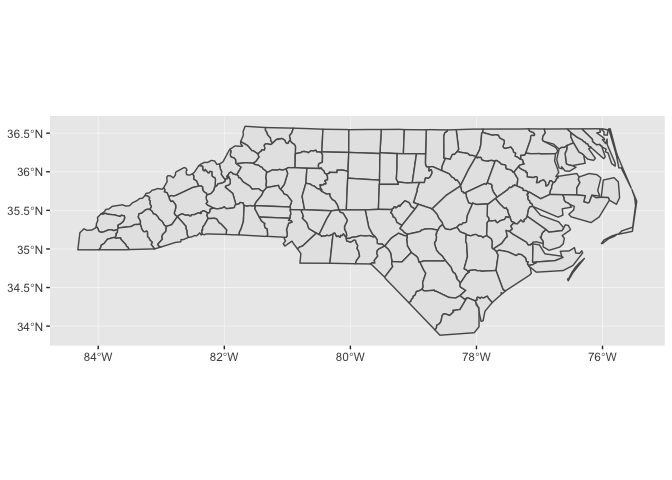

<!-- Generated automatically from spatial-vis.yml. Do not edit by hand -->

# Spatial visualization <small class='visualize'>[visualize]</small>
<small>(Builds on: [Spatial basics](spatial-basics.md))</small>


## Setup

We’ll start by reading in a couple of sample data sets, as well as
loading the sf package.

``` r
library(tidyverse)
library(sf)

nc_1974 <- 
  read_sf(system.file("shape/nc.shp", package = "sf")) %>% 
  select(FIPS, NAME, births = BIR74, sids = SID74,  geometry) %>% 
  rename_all(str_to_lower) 

states <- st_as_sf(maps::map("state", plot = FALSE, fill = TRUE))
```

In Spatial basics, you learned how to plot spatial data using the
`plot()` function. Now, we’ll show you how to visualize spatial data
using `geom_sf()`. The advantage of `geom_sf()` is that, as part of
ggplot2, you can layer geoms, use scales functions to change colors,
tweak your legends, alter the theme, etc.

## `geom_sf()`

`nc_74` contains data on deaths from Sudden Infant Death Syndrome (SIDS)
in 1974 for counties in North Carolina.

``` r
nc_1974
#> Simple feature collection with 100 features and 4 fields
#> geometry type:  MULTIPOLYGON
#> dimension:      XY
#> bbox:           xmin: -84.32385 ymin: 33.88199 xmax: -75.45698 ymax: 36.58965
#> epsg (SRID):    4267
#> proj4string:    +proj=longlat +datum=NAD27 +no_defs
#> # A tibble: 100 x 5
#>    fips  name     births  sids                                     geometry
#>    <chr> <chr>     <dbl> <dbl>                           <MULTIPOLYGON [°]>
#>  1 37009 Ashe       1091     1 (((-81.47276 36.23436, -81.54084 36.27251, …
#>  2 37005 Allegha…    487     0 (((-81.23989 36.36536, -81.24069 36.37942, …
#>  3 37171 Surry      3188     5 (((-80.45634 36.24256, -80.47639 36.25473, …
#>  4 37053 Curritu…    508     1 (((-76.00897 36.3196, -76.01735 36.33773, -…
#>  5 37131 Northam…   1421     9 (((-77.21767 36.24098, -77.23461 36.2146, -…
#>  6 37091 Hertford   1452     7 (((-76.74506 36.23392, -76.98069 36.23024, …
#>  7 37029 Camden      286     0 (((-76.00897 36.3196, -75.95718 36.19377, -…
#>  8 37073 Gates       420     0 (((-76.56251 36.34057, -76.60424 36.31498, …
#>  9 37185 Warren      968     4 (((-78.30876 36.26004, -78.28293 36.29188, …
#> 10 37169 Stokes     1612     1 (((-80.02567 36.25023, -80.45301 36.25709, …
#> # … with 90 more rows
```

First, let’s just plot the county boundaries. `geom_sf()` works like the
other geoms, except that you don’t need to specify an aesthetic mapping.
By default, `geom_sf()` will plot your `geometry` column.

``` r
nc_1974 %>% 
  ggplot() +
  geom_sf()
```

<!-- -->

Notice that ggplot2 takes care of setting the aspect ratio correctly. If
we just plot a single county in North Carolina, the default aspect ratio
will be different.

``` r
nc_1974 %>% 
  filter(name == "Anson") %>% 
  ggplot() +
  geom_sf()
```

<!-- -->

Just like with other geoms, you can supply additional aesthetics. For
polygons like the counties of North Carolina, `fill` is the most useful
aesthetic. Let’s visualize the number of births by county.

``` r
nc_1974 %>% 
  ggplot(aes(fill = births)) +
  geom_sf(color = "white", size = 0.2)
```

<!-- -->

Maps like this one, in which geographic areas are colored according to
some variable, are called *choropleths*.

``` r
nc_1974 %>% 
  ggplot(aes(fill = births)) +
  geom_sf(color = "white", size = 0.2)
```

<!-- -->

Notice how it’s difficult to tell the difference between many of the
counties, especially those with very low numbers of births.

Let’s look at the distribution of births.

``` r
nc_1974 %>% 
  ggplot(aes(births)) +
  geom_histogram(binwidth = 500) +
  scale_x_continuous(breaks = seq(0, 2e5, 2e3))
```

<!-- -->

Almost all of the counties fall between 0 and 8,000, but because there
are some counties with births up to 22,000, the sequential color scale
will linearly map colors between 0 and 22,000.

One way to deal with this problem is to cap `births`.

``` r
nc_1974 %>% 
  mutate(births = pmin(births, 1e4)) %>% 
  ggplot(aes(fill = births)) +
  geom_sf()
```

<!-- -->

## Layering

When you include multiple geospatial layers, ggplot2 will ensure that
they all have a common coordinate reference system (CRS) so that it
makes sense to overlay them.

``` r
ggplot() +
  geom_sf(data = states) + 
  geom_sf(data = nc_1974)
```

<!-- -->

In the above code, we didn’t pipe any data into `ggplot()` because each
layer uses different data.

Because `geom_sf()` is part of ggplot2, you can combine `geom_sf()` with
other geoms.

``` r
raleigh <- 
  tibble(
    x = -78.644257,
    y = 35.787743,
    label = "Raleigh"
  )

nc_1974 %>% 
  mutate(births = pmin(births, 1e4)) %>% 
  ggplot() +
  geom_sf(aes(fill = births)) +
  geom_point(aes(x, y), color = "red", data = raleigh) +
  geom_label(aes(x, y, label = label), nudge_x = 0.8, data = raleigh) +
  scale_fill_gradient(low = "#efedf5", high = "#756bb1")
```

<!-- -->

In this case, the `x` and `y` positions of the Raleigh dot are assumed
be in the same CRS as the sf object.

You can find this lighter color scale, and many others, at the
[ColorBrewer website](http://colorbrewer2.org/#).

## `coord_sf()`

You’ll need to use `coord_sf()` for two reasons:

  - You want to zoom into a specified region of the plot.
    
    The following plot shows the SIDS rate by county.
    
    ``` r
    nc_1974 <-
      nc_1974 %>% 
      mutate(sids_rate = sids / births)
    
    nc_1974 %>% 
      ggplot(aes(fill = sids_rate)) + 
      geom_sf()
    ```
    
    <!-- -->
    
    Let’s zoom in on the county with the highest rate (and also change
    the color scale).
    
    ``` r
    nc_1974 %>% 
      ggplot(aes(fill = sids_rate)) + 
      geom_sf() +
      scale_fill_gradient(low = "#efedf5", high = "#756bb1") +
      coord_sf(xlim = c(-80.5, -79), ylim = c(34.8, 36))
    ```
    
    <!-- -->

  - You can also use `coord_sf()` to override the projection in the
    data. If you don’t specify the `crs` argument to `coord_sf()`, if
    defaults to the CRS given in the data.
    
    The CRS for the `states` data is
    
    ``` r
    states %>% 
      st_crs()
    #> Coordinate Reference System:
    #>   EPSG: 4326 
    #>   proj4string: "+proj=longlat +datum=WGS84 +no_defs"
    ```
    
    which produces a map that looks like this:
    
    ``` r
    states %>% 
      ggplot() +
      geom_sf()
    ```
    
    <!-- -->
    
    If you’re visualizing the entire US, it’s better to use the US
    Albers projection. Albers is an equal-area projection, which means
    it accurately reflects the areas of geographic regions. The ESPG
    code of US Albers is 102003.
    
    ``` r
    states %>% 
      ggplot() +
      geom_sf() +
      coord_sf(crs = st_crs(102003))
    ```
    
    <!-- -->

